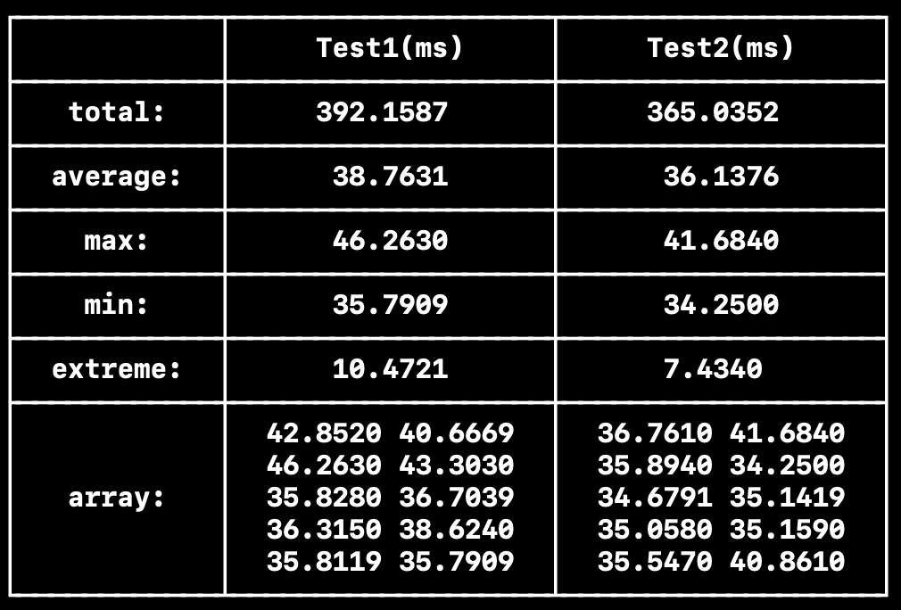

一个小工具，用于在控制台打印表格数据；如图所示：


## 示例代码
```swift
var columns: [[String]] = [
    ["", "total:", "average:", "max:", "min:", "extreme:", "array:"],
    ["Test1(ms)", "392.1587", "38.7631", "46.2630", "35.7909", "10.4721", "42.8520 40.6669\n46.2630 43.3030\n35.8280 36.7039\n36.3150 38.6240\n35.8119 35.7909"],
    ["Test2(ms)", "365.0352", "36.1376", "41.6840", "34.2500", "7.4340", "36.7610 41.6840\n35.8940 34.2500\n34.6791 35.1419\n35.0580 35.1590\n35.5470 40.8610"],
]

let table = plainTextTable(columns: columns, alignment: .center, space: 2)
print(table)
```

## 注意事项
表格内的建议只使用ASCII数据，如果使用其他数据可能会导致表格无法对齐。